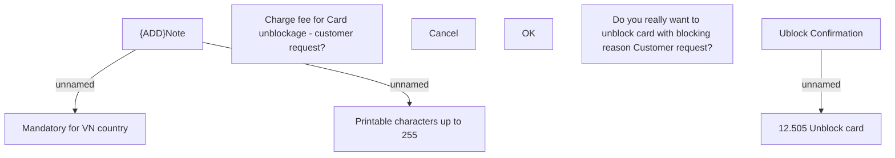

# Ublock Confirmation

- **Diagram Type**: Custom
- **Package**: HomerSelect/BSL/Analysis Model/Card management support/Card operations/User interface
- **Diagram ID**: 140756
- **Elements**: 9
- **Connectors**: 3

