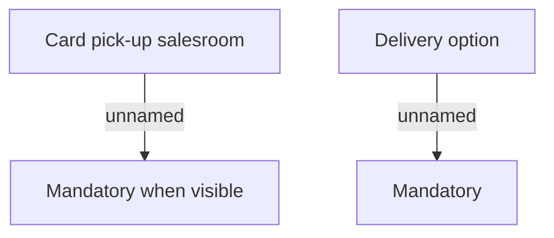

# Validation rules

```mermaid
graph TD
    Mandatory_when_visible["Mandatory when visible"]
    Mandatory["Mandatory"]
    Card_pick_up_salesroom["Card pick-up salesroom"]
    Delivery_option["Delivery option"]
    Delivery_option -->|unnamed| Mandatory
    Card_pick_up_salesroom -->|unnamed| Mandatory_when_visible
```
