# Access Rights

- **Diagram Type**: Custom
- **Package**: HomerSelect/BSL/Analysis Model/Client Management/Client center/Access Rights
- **Diagram ID**: 138525
- **Elements**: 25
- **Connectors**: 20

```mermaid
graph TD
    ADD_06_040_Show_client_data_display_Date_of_birth["{ADD}06.040 Show client data (display Date of birth)"]
    ADD_06_040_Search_clients_display_Gender["{ADD}06.040 Search clients (display Gender)"]
    ADD_06_040_Search_clients_display_Parent_name["{ADD}06.040 Search clients (display Parent name)"]
    ADD_06_030_Show_client_data_display_Gender["{ADD}06.030 Show client data (display Gender)"]
    ADD_06_030_Show_client_data_display_Parent_name["{ADD}06.030 Show client data (display Parent name)"]
    ADD_06_030_Show_client_data_display_Date_of_birth["{ADD}06.030 Show client data (display Date of birth)"]
    MOD_06_030_Show_client_data_show_documents["{MOD}06.030 Show client data (show documents)"]
    DEL_06_030_Show_client_data_display_additional_client_data["{DEL}06.030 Show client data (display additional client data)"]
    ADD_06_030_Show_client_data_show_client_address_data["{ADD}06.030 Show client data (show client address data)"]
    ADD_06_030_Show_client_data_show_unmasked_client_email["{ADD}06.030 Show client data (show unmasked client email)"]
    ADD_06_040_Search_clients_by_Name_and_Date_of_birth["{ADD}06.040 Search clients by Name and Date of birth"]
    ADD_06_032_Submit_response_on_customer_offer["{ADD}06.032 Submit response on customer offer"]
    MOD_06_032_Submit_response_on_customer_offer["{MOD}06.032 Submit response on customer offer"]
    ADD_06_030_Show_client_data_hidden_contracts["{ADD}06.030 Show client data (hidden contracts)"]
    n_06_030_Show_client_s_phone_Client_detail["06.030 Show client´s phone (Client detail)"]
    n_06_041_Show_client_s_safe_guaranty["06.041 Show client's safe guaranty"]
    n_06_041_Show_clients_safe_guaranty["06.041 Show clients safe guaranty"]
    n_06_060_Show_client_s_password["06.060 Show client's password"]
    n_06_060_Show_client_s_password["06.060 Show client's password"]
    n_06_030_Show_client_data_CB_results["06.030 Show client data (CB results)"]
    n_06_040_Search_clients["06.040 Search clients"]
    n_06_030_Show_client_data["06.030 Show client data"]
    n_06_030_Show_client_data_Manage_in_CIF["06.030 Show client data (Manage in CIF)"]
    MOD_06_030_Show_Client_Data["{MOD}06.030 Show Client Data"]
    MOD_06_040_Search_Clients["{MOD}06.040 Search Clients"]
    MOD_06_040_Search_Clients -->|unnamed| ADD_06_040_Show_client_data_display_Date_of_birth
    MOD_06_040_Search_Clients -->|unnamed| ADD_06_040_Search_clients_display_Gender
    MOD_06_040_Search_Clients -->|unnamed| ADD_06_040_Search_clients_display_Parent_name
    MOD_06_040_Search_Clients -->|unnamed| n_06_040_Search_clients
    MOD_06_040_Search_Clients -->|unnamed| ADD_06_040_Search_clients_by_Name_and_Date_of_birth
    MOD_06_032_Submit_response_on_customer_offer -->|unnamed| ADD_06_032_Submit_response_on_customer_offer
    n_06_041_Show_clients_safe_guaranty -->|unnamed| n_06_041_Show_client_s_safe_guaranty
    n_06_060_Show_client_s_password -->|unnamed| n_06_060_Show_client_s_password
    MOD_06_030_Show_Client_Data -->|unnamed| ADD_06_030_Show_client_data_show_client_address_data
    MOD_06_030_Show_Client_Data -->|unnamed| n_06_030_Show_client_data_Manage_in_CIF
    MOD_06_030_Show_Client_Data -->|unnamed| DEL_06_030_Show_client_data_display_additional_client_data
    MOD_06_030_Show_Client_Data -->|unnamed| MOD_06_030_Show_client_data_show_documents
    MOD_06_030_Show_Client_Data -->|unnamed| ADD_06_030_Show_client_data_display_Gender
    MOD_06_030_Show_Client_Data -->|unnamed| ADD_06_030_Show_client_data_display_Date_of_birth
    MOD_06_030_Show_Client_Data -->|unnamed| n_06_030_Show_client_s_phone_Client_detail
    MOD_06_030_Show_Client_Data -->|unnamed| n_06_030_Show_client_data
    MOD_06_030_Show_Client_Data -->|unnamed| ADD_06_030_Show_client_data_display_Parent_name
    MOD_06_030_Show_Client_Data -->|unnamed| n_06_030_Show_client_data_CB_results
    MOD_06_030_Show_Client_Data -->|unnamed| ADD_06_030_Show_client_data_show_unmasked_client_email
    MOD_06_030_Show_Client_Data -->|unnamed| ADD_06_030_Show_client_data_hidden_contracts
```

