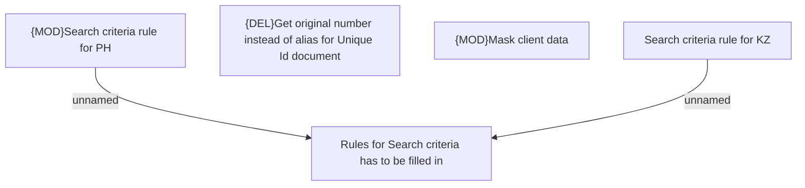

# Search clients

```mermaid
graph TD
    MOD_Search_criteria_rule_for_PH["{MOD}Search criteria rule for PH"]
    DEL_Get_original_number_instead_of_alias_for_Unique_Id_docum["{DEL}Get original number instead of alias for Unique Id document"]
    MOD_Mask_client_data["{MOD}Mask client data"]
    Search_criteria_rule_for_KZ["Search criteria rule for KZ"]
    Rules_for_Search_criteria_has_to_be_filled_in["Rules for Search criteria has to be filled in "]
    MOD_Search_criteria_rule_for_PH -->|unnamed| Rules_for_Search_criteria_has_to_be_filled_in
    Search_criteria_rule_for_KZ -->|unnamed| Rules_for_Search_criteria_has_to_be_filled_in
```
