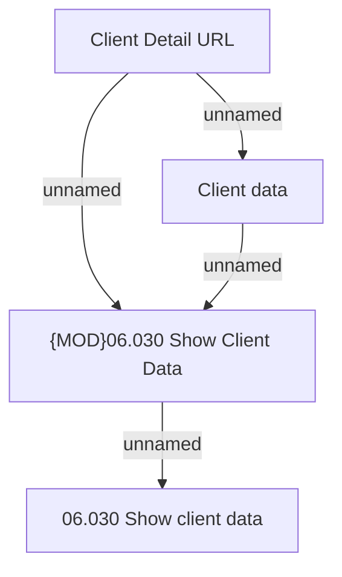

# Client detail URL

- **Diagram Type**: Custom
- **Package**: HomerSelect/BSL/Analysis Model/Client Management/Client center/User Interface model/Client detail
- **Diagram ID**: 144626
- **Elements**: 4
- **Connectors**: 4

