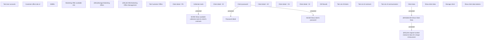

# Client detail

```mermaid
graph TD
    Tab_User_accounts["Tab User accounts"]
    Customer_offers_tab_v2["Customer offers tab v2"]
    AMMIL["AMMIL"]
    DEL_Get_original_number_instead_of_alias_for_Unique_Id_docum["{DEL}Get original number instead of alias for Unique Id document"]
    Marketing_Offer_available_info["Marketing Offer available info"]
    DEL_Manage_Marketing_Offers["{DEL}Manage Marketing Offers"]
    DEL_02_906_Marketing_Offers_Management["{DEL}02.906 Marketing Offers Management"]
    Tab_Customer_Offers["Tab Customer Offers"]
    Client_detail_PH["Client detail - PH"]
    n_08_900_Show_available_collection_tools_for_client_s_contra["08.900 Show available collection tools for client's contracts"]
    Password_detail["Password detail"]
    Collection_tools["Collection tools"]
    Client_detail_ID["Client detail - ID"]
    n_06_060_Show_client_s_password["06.060 Show client's password"]
    Client_password["Client password"]
    Client_detail_KZ["Client detail - KZ"]
    Client_detail_VN["Client detail - VN"]
    Client_detail_IN["Client detail - IN"]
    CB_Results["CB Results"]
    Tab_List_of_tickets["Tab List of tickets"]
    Tab_List_of_contracts["Tab List of contracts"]
    Tab_List_of_communication["Tab List of communication"]
    MOD_06_030_Show_Client_Data["{MOD}06.030 Show Client Data"]
    Client_data["Client data"]
    Show_client_data["Show client data"]
    Manage_client["Manage client"]
    Show_client_data_buttons["Show client data buttons"]
    Client_data["Client data"]
    Client_data -->|unnamed| MOD_06_030_Show_Client_Data
    Client_password -->|unnamed| n_06_060_Show_client_s_password
    Client_password -->|unnamed| Password_detail
    Collection_tools -->|unnamed| n_08_900_Show_available_collection_tools_for_client_s_contra
    MOD_06_030_Show_Client_Data -->|unnamed| DEL_Get_original_number_instead_of_alias_for_Unique_Id_docum
```
