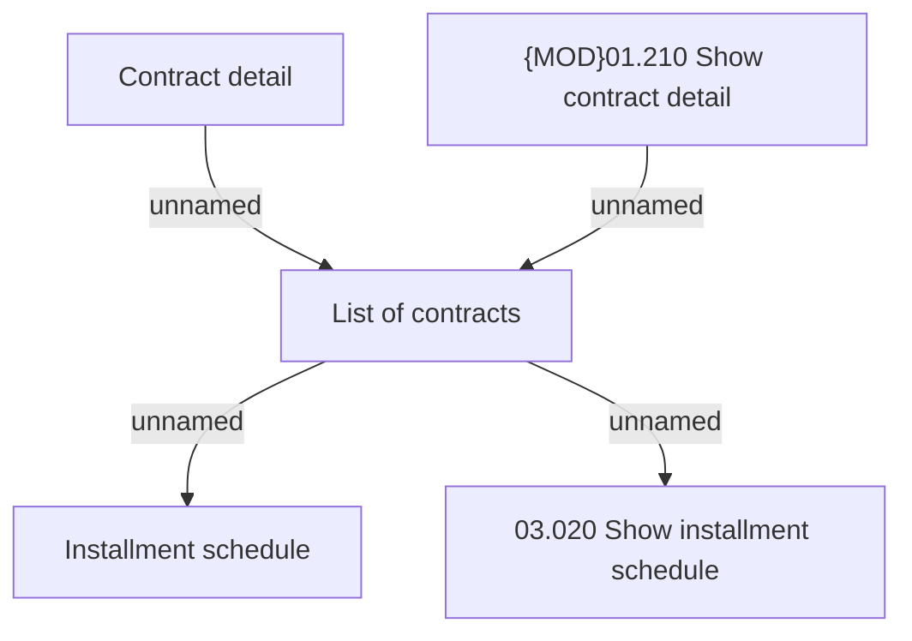

# List of contracts - Default

```mermaid
graph TD
    n_03_020_Show_installment_schedule["03.020 Show installment schedule"]
    MOD_01_210_Show_contract_detail["{MOD}01.210 Show contract detail"]
    Installment_schedule["Installment schedule"]
    Contract_detail["Contract detail"]
    List_of_contracts["List of contracts"]
    Contract_detail -->|unnamed| List_of_contracts
    MOD_01_210_Show_contract_detail -->|unnamed| List_of_contracts
    List_of_contracts -->|unnamed| Installment_schedule
    List_of_contracts -->|unnamed| n_03_020_Show_installment_schedule
```
