# Tab User accounts

- **Diagram Type**: Custom
- **Package**: HomerSelect/BSL/Analysis Model/Client Management/Client center/User Interface model/Client detail
- **Diagram ID**: 144627
- **Elements**: 16
- **Connectors**: 2

```mermaid
graph TD
    User_account_login_history["User account login history"]
    ADD_User_account_login_history["{ADD}User account login history"]
    Last_failed_login["Last failed login"]
    Last_login["Last login"]
    Facebook_account["Facebook account"]
    Registration_email["Registration email"]
    Registration_phone["Registration phone"]
    Registration_date["Registration date"]
    Account_status["Account status"]
    Username["Username"]
    Show_login_history["Show login history"]
    Unblock_user["Unblock user"]
    Block_user["Block user"]
    User_Account["User Account"]
    ADD_Tab_User_Accounts["{ADD}Tab User Accounts"]
    Client_detail_screen["Client detail screen"]
    ADD_Tab_User_Accounts -->|unnamed| Client_detail_screen
    Show_login_history -->|unnamed| ADD_User_account_login_history
```

