# Client detail - ID

- **Diagram Type**: Custom
- **Package**: HomerSelect/BSL/Analysis Model/Client Management/Client center/User Interface model/Client detail/ID
- **Diagram ID**: 132277
- **Elements**: 33
- **Connectors**: 0

```mermaid
graph TD
    ADD_AMMIL["{ADD}AMMIL"]
    MOD_Primary_e_mail["{MOD}Primary e-mail"]
    MOD_Phone["{MOD}Phone"]
    MOD_Primary_mobile["{MOD}Primary mobile"]
    MOD_Gender["{MOD}Gender"]
    CUID["CUID"]
    MOD_Birth_date["{MOD}Birth date"]
    Statement_channel["Statement channel "]
    Identification_document_number["Identification document - number"]
    Identification_document_type_name["Identification document - type name"]
    Permanent_address["Permanent address"]
    Zip_code["Zip code"]
    Sub_district["Sub-district"]
    Street_name_block_and_number["Street name, block and number"]
    Regency["Regency"]
    Neighborhood_number["Neighborhood number"]
    Community_unit_number["Community unit number"]
    n_["/"]
    Village["Village"]
    Contact_address["Contact address"]
    Preffered_language["Preffered language"]
    Zip_code["Zip code"]
    Community_unit_number["Community unit number"]
    n_["/"]
    Neighborhood_number["Neighborhood number"]
    Village["Village"]
    Sub_district["Sub-district"]
    Regency["Regency"]
    Street_name_block_and_number["Street name, block and number"]
    Mother_s_name["Mother's name"]
    Last_name["Last name"]
    First_name["First name"]
    Client_detail_ID["Client detail - ID"]
```

