# Client detail - IN

- **Diagram Type**: Custom
- **Package**: HomerSelect/BSL/Analysis Model/Client Management/Client center/User Interface model/Client detail/IN
- **Diagram ID**: 157655
- **Elements**: 18
- **Connectors**: 0

```mermaid
graph TD
    ADD_AMMIL["{ADD}AMMIL"]
    MOD_Phone_number_visibility_setting["{MOD}Phone number visibility setting"]
    Statement_channel["Statement channel "]
    Total_overdue_debt["Total overdue debt"]
    Total_unpaid_debt["Total unpaid debt"]
    MOD_Identification_documents["{MOD}Identification documents"]
    MOD_Primary_mobile["{MOD}Primary mobile"]
    MOD_Primary_e_mail["{MOD}Primary e-mail"]
    Preferred_languages["Preferred languages"]
    MOD_Phone["{MOD}Phone"]
    Permanent_address["Permanent address"]
    MOD_Gender["{MOD}Gender"]
    MOD_Father_full_name["{MOD}Father full name"]
    Contact_address["Contact address"]
    Client_full_name["Client full name"]
    CUID["CUID"]
    MOD_Birth_date["{MOD}Birth date"]
    Show_client_data_panel["Show client data panel"]
```

