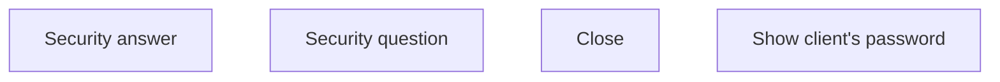

# Password detail

- **Diagram Type**: Custom
- **Package**: HomerSelect/BSL/Analysis Model/Client Management/Client center/User Interface model/Client detail/IN
- **Diagram ID**: 157654
- **Elements**: 4
- **Connectors**: 0

