# Client detail - KZ

- **Diagram Type**: Custom
- **Package**: HomerSelect/BSL/Analysis Model/Client Management/Client center/User Interface model/Client detail/KZ
- **Diagram ID**: 132279
- **Elements**: 20
- **Connectors**: 0

```mermaid
graph TD
    ADD_AMMIL["{ADD}AMMIL"]
    ADD_Economical_status["{ADD}Economical status"]
    Preferred_language["Preferred language"]
    Age["Age"]
    Statement_channel["Statement channel "]
    Total_unpaid_debt["Total unpaid debt"]
    Total_overdue_debt["Total overdue debt"]
    MOD_Identification_documents["{MOD}Identification documents"]
    MOD_Primary_mobile["{MOD}Primary mobile"]
    National_identification_number["National identification number"]
    MOD_Primary_e_mail["{MOD}Primary e-mail"]
    MOD_Phone["{MOD}Phone"]
    Permanent_address["Permanent address"]
    MOD_Gender["{MOD}Gender"]
    MOD_Father_full_name["{MOD}Father full name"]
    Contact_address["Contact address"]
    Client_full_name["Client full name"]
    CUID["CUID"]
    MOD_Birth_date["{MOD}Birth date"]
    Client_detail_KZ["Client detail - KZ"]
```

