# List of contracts - KZ

- **Diagram Type**: Custom
- **Package**: HomerSelect/BSL/Analysis Model/Client Management/Client center/User Interface model/Client detail/KZ
- **Diagram ID**: 132278
- **Elements**: 13
- **Connectors**: 14

```mermaid
graph TD
    n_01_478_Show_supposed_debt_for_CEL_contract["01.478 Show supposed debt for CEL contract"]
    n_01_479_Show_supposed_debt_for_REL_contract["01.479 Show supposed debt for REL contract"]
    Debt_calculator["Debt calculator"]
    Show_account_detail["Show account detail"]
    MOD_12_601_Show_account_detail["{MOD}12.601 Show account detail"]
    REL_Installment_schedule["REL Installment schedule"]
    n_03_021_Show_REL_installment_schedule["03.021 Show REL installment schedule"]
    MOD_Business_type_of_loan["{MOD}Business type of loan"]
    n_03_020_Show_installment_schedule["03.020 Show installment schedule"]
    MOD_01_210_Show_contract_detail["{MOD}01.210 Show contract detail"]
    Installment_schedule["Installment schedule"]
    Contract_detail["Contract detail"]
    List_of_contracts["List of contracts"]
    List_of_contracts -->|unnamed| Debt_calculator
    List_of_contracts -->|unnamed| Show_account_detail
    List_of_contracts -->|unnamed| MOD_12_601_Show_account_detail
    List_of_contracts -->|unnamed| REL_Installment_schedule
    List_of_contracts -->|unnamed| MOD_Business_type_of_loan
    List_of_contracts -->|unnamed| Contract_detail
    List_of_contracts -->|unnamed| MOD_Business_type_of_loan
    List_of_contracts -->|unnamed| n_03_020_Show_installment_schedule
    List_of_contracts -->|unnamed| MOD_01_210_Show_contract_detail
    List_of_contracts -->|unnamed| Installment_schedule
    List_of_contracts -->|unnamed| n_03_021_Show_REL_installment_schedule
    MOD_12_601_Show_account_detail -->|unnamed| MOD_Business_type_of_loan
    n_03_021_Show_REL_installment_schedule -->|unnamed| MOD_Business_type_of_loan
    n_03_020_Show_installment_schedule -->|unnamed| MOD_Business_type_of_loan
```

