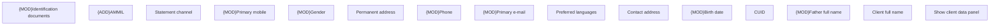

# Client detail - PH

```mermaid
graph TD
    MOD_Identification_documents["{MOD}Identification documents"]
    ADD_AMMIL["{ADD}AMMIL"]
    Statement_channel["Statement channel "]
    MOD_Primary_mobile["{MOD}Primary mobile"]
    MOD_Gender["{MOD}Gender"]
    Permanent_address["Permanent address"]
    MOD_Phone["{MOD}Phone"]
    MOD_Primary_e_mail["{MOD}Primary e-mail"]
    Preferred_languages["Preferred languages"]
    Contact_address["Contact address"]
    MOD_Birth_date["{MOD}Birth date"]
    CUID["CUID"]
    MOD_Father_full_name["{MOD}Father full name"]
    Client_full_name["Client full name"]
    Show_client_data_panel["Show client data panel"]
```
