# Client detail - VN

- **Diagram Type**: Custom
- **Package**: HomerSelect/BSL/Analysis Model/Client Management/Client center/User Interface model/Client detail/VN
- **Diagram ID**: 132274
- **Elements**: 12
- **Connectors**: 0

```mermaid
graph TD
    Statement_channel["Statement channel "]
    MOD_Primary_mobile["{MOD}Primary mobile"]
    MOD_Identification_documents["{MOD}Identification documents"]
    MOD_Primary_e_mail["{MOD}Primary e-mail"]
    MOD_Phone["{MOD}Phone"]
    Permanent_address["Permanent address"]
    MOD_Gender["{MOD}Gender"]
    Contact_address["Contact address"]
    Client_full_name["Client full name"]
    CUID["CUID"]
    MOD_Birth_date["{MOD}Birth date"]
    Client_detail_VN["Client detail - VN"]
```

