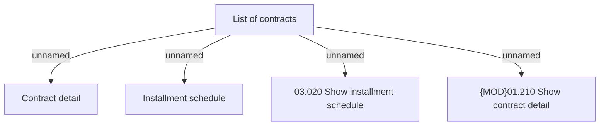

# List of contracts - VN

```mermaid
graph TD
    MOD_01_210_Show_contract_detail["{MOD}01.210 Show contract detail"]
    n_03_020_Show_installment_schedule["03.020 Show installment schedule"]
    Installment_schedule["Installment schedule"]
    Contract_detail["Contract detail"]
    List_of_contracts["List of contracts"]
    List_of_contracts -->|unnamed| Contract_detail
    List_of_contracts -->|unnamed| Installment_schedule
    List_of_contracts -->|unnamed| n_03_020_Show_installment_schedule
    List_of_contracts -->|unnamed| MOD_01_210_Show_contract_detail
```
