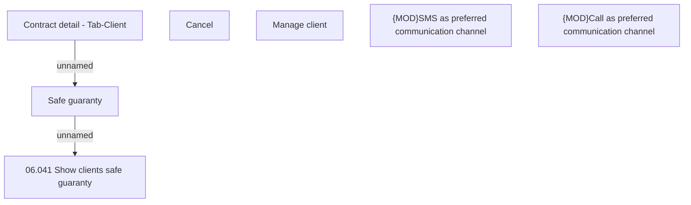

# Safe guaranty

```mermaid
graph TD
    Contract_detail_Tab_Client["Contract detail - Tab-Client"]
    n_06_041_Show_clients_safe_guaranty["06.041 Show clients safe guaranty"]
    Cancel["Cancel"]
    Manage_client["Manage client"]
    MOD_SMS_as_preferred_communication_channel["{MOD}SMS as preferred communication channel"]
    MOD_Call_as_preferred_communication_channel["{MOD}Call as preferred communication channel"]
    Safe_guaranty["Safe guaranty"]
    Safe_guaranty["Safe guaranty"]
    Contract_detail_Tab_Client -->|unnamed| Safe_guaranty
    Safe_guaranty -->|unnamed| n_06_041_Show_clients_safe_guaranty
```
