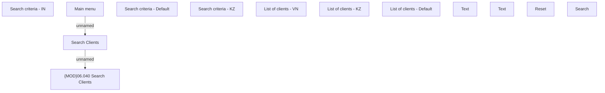

# Search Clients

- **Diagram Type**: Custom
- **Package**: HomerSelect/BSL/Analysis Model/Client Management/Client center/User Interface model/Search clients
- **Diagram ID**: 125473
- **Elements**: 13
- **Connectors**: 2

