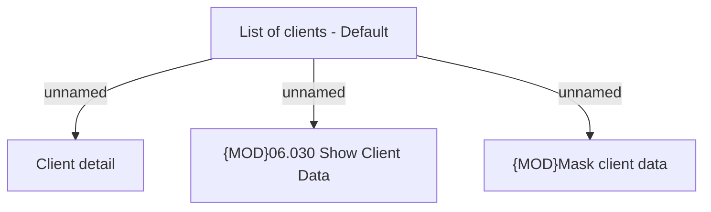

# List of clients - Default

- **Diagram Type**: Custom
- **Package**: HomerSelect/BSL/Analysis Model/Client Management/Client center/User Interface model/Search clients/Default
- **Diagram ID**: 126773
- **Elements**: 4
- **Connectors**: 3

