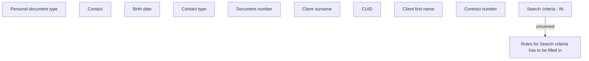

# IN

- **Diagram Type**: Custom
- **Package**: HomerSelect/BSL/Analysis Model/Client Management/Client center/User Interface model/Search clients/IN
- **Diagram ID**: 129233
- **Elements**: 11
- **Connectors**: 1

