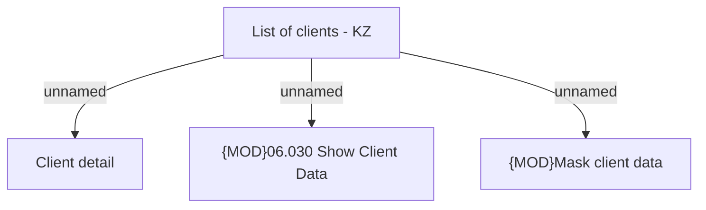

# List of clients - KZ

```mermaid
graph TD
    MOD_Mask_client_data["{MOD}Mask client data"]
    MOD_06_030_Show_Client_Data["{MOD}06.030 Show Client Data"]
    Client_detail["Client detail"]
    List_of_clients_KZ["List of clients - KZ"]
    List_of_clients_KZ -->|unnamed| Client_detail
    List_of_clients_KZ -->|unnamed| MOD_06_030_Show_Client_Data
    List_of_clients_KZ -->|unnamed| MOD_Mask_client_data
```
