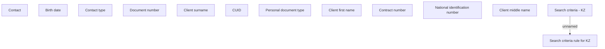

# Search criteria - KZ

```mermaid
graph TD
    Search_criteria_rule_for_KZ["Search criteria rule for KZ"]
    Contact["Contact"]
    Birth_date["Birth date"]
    Contact_type["Contact type"]
    Document_number["Document number"]
    Client_surname["Client surname"]
    CUID["CUID"]
    Personal_document_type["Personal document type"]
    Client_first_name["Client first name"]
    Contract_number["Contract number"]
    National_identification_number["National identification number"]
    Client_middle_name["Client middle name"]
    Search_criteria_KZ["Search criteria - KZ"]
    Search_criteria_KZ -->|unnamed| Search_criteria_rule_for_KZ
```
