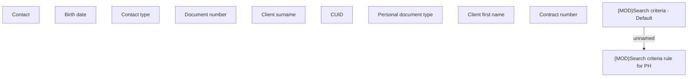

# Search criteria - PH

```mermaid
graph TD
    Contact["Contact"]
    Birth_date["Birth date"]
    Contact_type["Contact type"]
    Document_number["Document number"]
    Client_surname["Client surname"]
    CUID["CUID"]
    Personal_document_type["Personal document type"]
    Client_first_name["Client first name"]
    Contract_number["Contract number"]
    MOD_Search_criteria_Default["{MOD}Search criteria - Default"]
    MOD_Search_criteria_rule_for_PH["{MOD}Search criteria rule for PH"]
    MOD_Search_criteria_Default -->|unnamed| MOD_Search_criteria_rule_for_PH
```
