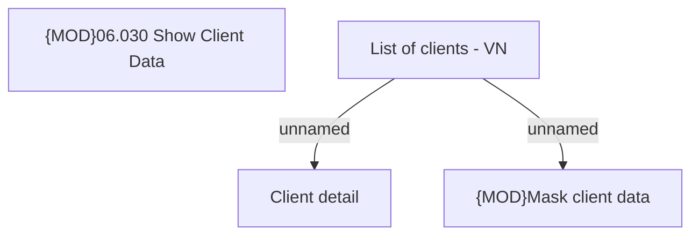

# List of clients - VN

- **Diagram Type**: Custom
- **Package**: HomerSelect/BSL/Analysis Model/Client Management/Client center/User Interface model/Search clients/VN
- **Diagram ID**: 89798
- **Elements**: 4
- **Connectors**: 2

