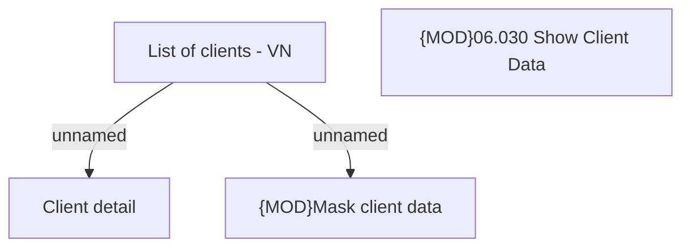

# List of clients - VN

```mermaid
graph TD
    MOD_Mask_client_data["{MOD}Mask client data"]
    Client_detail["Client detail"]
    List_of_clients_VN["List of clients - VN"]
    MOD_06_030_Show_Client_Data["{MOD}06.030 Show Client Data"]
    List_of_clients_VN -->|unnamed| Client_detail
    List_of_clients_VN -->|unnamed| MOD_Mask_client_data
```
