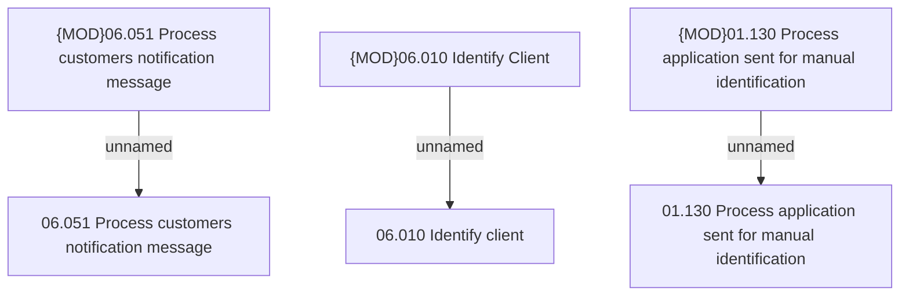

# Access Rights

- **Diagram Type**: Custom
- **Package**: HomerSelect/BSL/Analysis Model/Client Management/Client identification/Access Rights
- **Diagram ID**: 88697
- **Elements**: 6
- **Connectors**: 3

