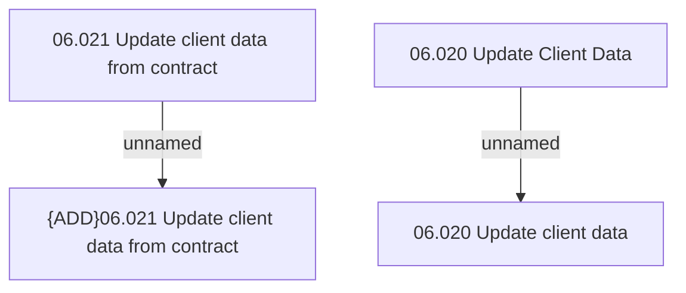

# Access Rights

```mermaid
graph TD
    n_06_021_Update_client_data_from_contract["06.021 Update client data from contract"]
    ADD_06_021_Update_client_data_from_contract["{ADD}06.021 Update client data from contract"]
    n_06_020_Update_client_data["06.020 Update client data"]
    n_06_020_Update_Client_Data["06.020 Update Client Data"]
    n_06_020_Update_Client_Data -->|unnamed| n_06_020_Update_client_data
    n_06_021_Update_client_data_from_contract -->|unnamed| ADD_06_021_Update_client_data_from_contract
```
