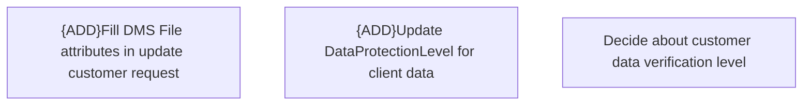

# Business Rules

```mermaid
graph TD
    ADD_Fill_DMS_File_attributes_in_update_customer_request["{ADD}Fill DMS File attributes in update customer request"]
    ADD_Update_DataProtectionLevel_for_client_data["{ADD}Update DataProtectionLevel for client data"]
    Decide_about_customer_data_verification_level["Decide about customer data verification level"]
```
