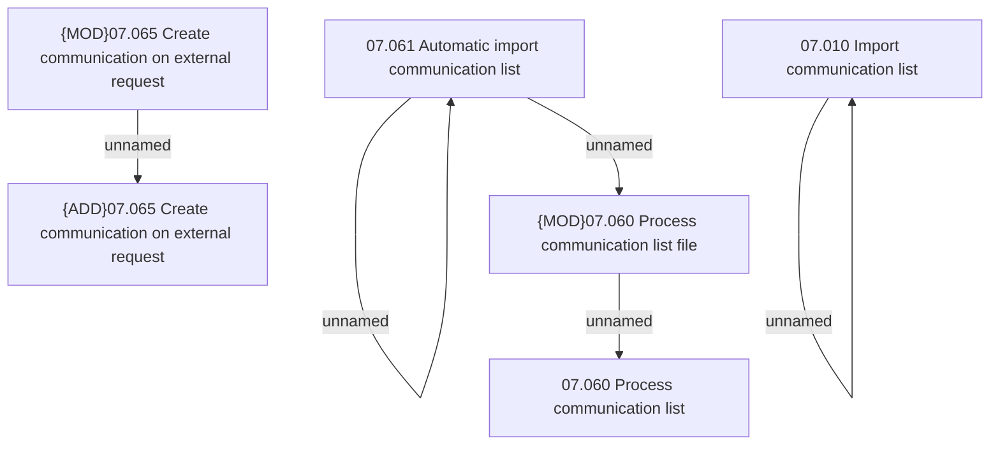

# Access Rights

```mermaid
graph TD
    ADD_07_065_Create_communication_on_external_request["{ADD}07.065 Create communication on external request"]
    MOD_07_065_Create_communication_on_external_request["{MOD}07.065 Create communication on external request"]
    n_07_061_Automatic_import_communication_list["07.061 Automatic import communication list"]
    n_07_061_Automatic_import_communication_list["07.061 Automatic import communication list"]
    n_07_060_Process_communication_list["07.060 Process communication list"]
    n_07_010_Import_communication_list["07.010 Import communication list"]
    MOD_07_060_Process_communication_list_file["{MOD}07.060 Process communication list file"]
    n_07_010_Import_communication_list["07.010 Import communication list"]
    n_07_061_Automatic_import_communication_list -->|unnamed| n_07_061_Automatic_import_communication_list
    n_07_061_Automatic_import_communication_list -->|unnamed| MOD_07_060_Process_communication_list_file
    MOD_07_060_Process_communication_list_file -->|unnamed| n_07_060_Process_communication_list
    n_07_010_Import_communication_list -->|unnamed| n_07_010_Import_communication_list
    MOD_07_065_Create_communication_on_external_request -->|unnamed| ADD_07_065_Create_communication_on_external_request
```
