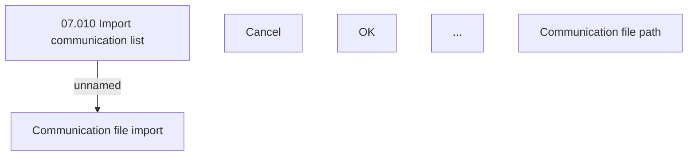

# Communication file import

- **Diagram Type**: Custom
- **Package**: HomerSelect/BSL/Analysis Model/Client Management/Communication/Import list of communication/User Interface
- **Diagram ID**: 46383
- **Elements**: 6
- **Connectors**: 1

