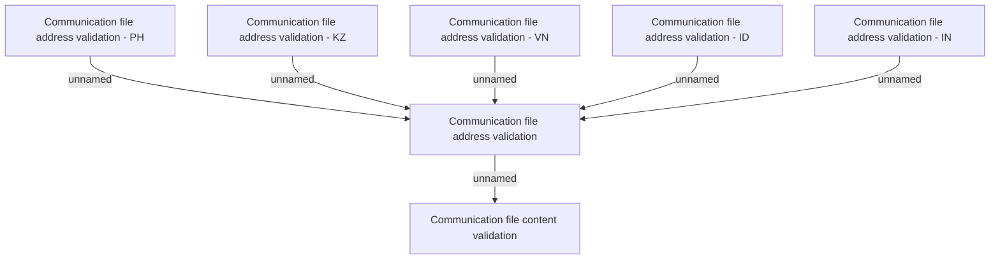

# Validations

- **Diagram Type**: Custom
- **Package**: HomerSelect/BSL/Analysis Model/Client Management/Communication/Import list of communication/Validations
- **Diagram ID**: 131457
- **Elements**: 7
- **Connectors**: 6

