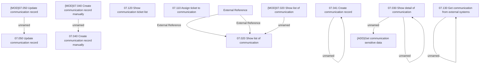

# Access Rights

```mermaid
graph TD
    ADD_Get_communication_sensitive_data["{ADD}Get communication sensitive data"]
    n_07_041_Create_communication_record["07.041 Create communication record"]
    n_07_041_Create_communication_record["07.041 Create communication record"]
    n_07_130_Get_communication_from_external_systems["07.130 Get communication from external systems"]
    n_07_130_Get_communication_from_external_systems["07.130 Get communication from external systems"]
    n_07_120_Show_communication_ticket_list["07.120 Show communication ticket list"]
    n_07_110_Assign_ticket_to_communication["07.110 Assign ticket to communication"]
    n_07_050_Update_communication_record["07.050 Update communication record"]
    n_07_040_Create_communication_record_manually["07.040 Create communication record manually"]
    External_Reference["External Reference"]
    n_07_030_Show_detail_of_communication["07.030 Show detail of communication"]
    External_Reference["External Reference"]
    MOD_07_050_Update_communication_record["{MOD}07.050 Update communication record"]
    MOD_07_040_Create_communication_record_manually["{MOD}07.040 Create communication record manually"]
    n_07_030_Show_detail_of_communication["07.030 Show detail of communication"]
    MOD_07_020_Show_list_of_communication["{MOD}07.020 Show list of communication"]
    n_07_020_Show_list_of_communication["07.020 Show list of communication"]
    External_Reference -->|External Reference| n_07_020_Show_list_of_communication
    External_Reference -->|External Reference| n_07_020_Show_list_of_communication
    n_07_030_Show_detail_of_communication -->|unnamed| ADD_Get_communication_sensitive_data
    MOD_07_040_Create_communication_record_manually -->|unnamed| n_07_040_Create_communication_record_manually
    n_07_041_Create_communication_record -->|unnamed| n_07_041_Create_communication_record
    n_07_030_Show_detail_of_communication -->|unnamed| n_07_030_Show_detail_of_communication
    MOD_07_020_Show_list_of_communication -->|unnamed| n_07_020_Show_list_of_communication
    MOD_07_050_Update_communication_record -->|unnamed| n_07_050_Update_communication_record
    n_07_130_Get_communication_from_external_systems -->|unnamed| n_07_130_Get_communication_from_external_systems
```
