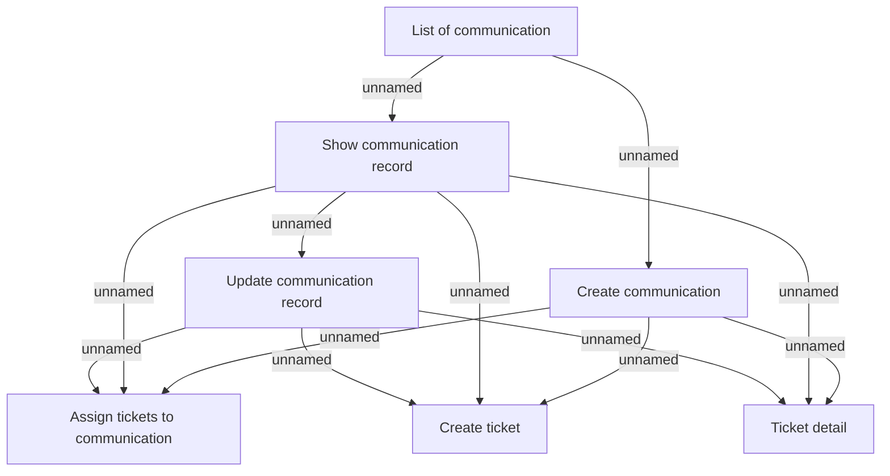

# User Interface Model

- **Diagram Type**: Custom
- **Package**: HomerSelect/BSL/Analysis Model/Client Management/Communication/Manage communication/User Interface
- **Diagram ID**: 91316
- **Elements**: 7
- **Connectors**: 12

