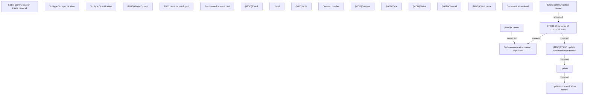

# Show communication record

- **Diagram Type**: Custom
- **Package**: HomerSelect/BSL/Analysis Model/Client Management/Communication/Manage communication/User Interface/Communication detail
- **Diagram ID**: 147689
- **Elements**: 23
- **Connectors**: 6

