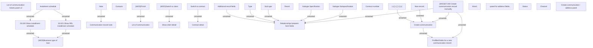

# Create communication

```mermaid
graph TD
    List_of_communication_tickets_panel_v2["List of communication tickets panel v2"]
    Subtype_Subspecification["Subtype Subspecification"]
    Subtype_Specification["Subtype Specification"]
    MOD_Business_type_of_loan["{MOD}Business type of loan"]
    n_03_020_Show_installment_schedule["03.020 Show installment schedule"]
    n_03_021_Show_REL_installment_schedule["03.021 Show REL installment schedule"]
    Communication_record_note["Communication record note"]
    Contacts["Contacts"]
    List_of_communication["List of communication"]
    Show_client_detail["Show client detail"]
    Contract_detail["Contract detail"]
    Instalment_schedule["Instalment schedule"]
    MOD_Finish["{MOD}Finish"]
    Switch_to_contract["Switch to contract"]
    MOD_07_040_Create_communication_record_manually["{MOD}07.040 Create communication record manually"]
    MOD_Switch_to_client["{MOD}Switch to client"]
    New_record["New record"]
    Prefilled_fields_for_a_new_communication_record["Prefilled fields for a new communication record"]
    Result["Result"]
    Additional_result_fields["Additional result fields"]
    Note["Note"]
    Contract_number["Contract number"]
    n_["[‹‹] [‹ ] [ ›] [››]"]
    Sub_type["Sub type"]
    Type["Type"]
    hline1["hline1"]
    panel_for_address_fields["‹panel for address fields›"]
    Status["Status"]
    Channel["Channel"]
    Create_communication_address_panel["Create communication - address panel"]
    Relationships_between_form_fields["Relationships between form fields"]
    Create_communication["Create communication"]
    MOD_Switch_to_client -->|unnamed| Show_client_detail
    Note -->|unnamed| Communication_record_note
    Additional_result_fields -->|unnamed| Relationships_between_form_fields
    Instalment_schedule -->|unnamed| n_03_021_Show_REL_installment_schedule
    Instalment_schedule -->|unnamed| n_03_020_Show_installment_schedule
    Create_communication -->|unnamed| Prefilled_fields_for_a_new_communication_record
    Type -->|unnamed| Relationships_between_form_fields
    Sub_type -->|unnamed| Relationships_between_form_fields
    Subtype_Specification -->|unnamed| Relationships_between_form_fields
    Switch_to_contract -->|unnamed| Contract_detail
    MOD_Finish -->|unnamed| List_of_communication
    n_ -->|unnamed| Create_communication
    New_record -->|unnamed| Create_communication
    Subtype_Subspecification -->|unnamed| Relationships_between_form_fields
    n_03_020_Show_installment_schedule -->|unnamed| MOD_Business_type_of_loan
    n_03_021_Show_REL_installment_schedule -->|unnamed| MOD_Business_type_of_loan
    MOD_07_040_Create_communication_record_manually -->|unnamed| Create_communication
    MOD_07_040_Create_communication_record_manually -->|unnamed| Prefilled_fields_for_a_new_communication_record
    MOD_07_040_Create_communication_record_manually -->|unnamed| Relationships_between_form_fields
```
