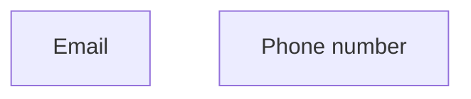

# Contacts - IN

- **Diagram Type**: Custom
- **Package**: HomerSelect/BSL/Analysis Model/Client Management/Communication/Manage communication/User Interface/Create communication/Contacts/IN
- **Diagram ID**: 91314
- **Elements**: 2
- **Connectors**: 0

