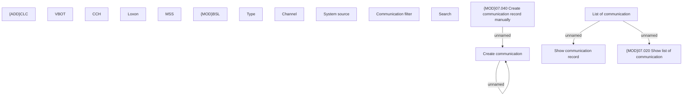

# List of communication

- **Diagram Type**: Custom
- **Package**: HomerSelect/BSL/Analysis Model/Client Management/Communication/Manage communication/User Interface/List of communication
- **Diagram ID**: 147448
- **Elements**: 18
- **Connectors**: 4

