# Update communication record

- **Diagram Type**: Custom
- **Package**: HomerSelect/BSL/Analysis Model/Client Management/Communication/Manage communication/User Interface/Update communication record
- **Diagram ID**: 107546
- **Elements**: 31
- **Connectors**: 9

```mermaid
graph TD
    Subtype_Subspecification["Subtype Subspecification"]
    Subtype_Specification["Subtype Specification"]
    Communication_record_note["Communication record note"]
    Show_communication_record["Show communication record"]
    Yes["Yes"]
    el_1309459["Text"]
    No["No"]
    Yes["Yes"]
    el_1309460["Text"]
    Cancel["Cancel"]
    OK["OK"]
    List_of_communication_tickets["List of communication tickets"]
    Relationships_between_form_fields["Relationships between form fields"]
    MOD_07_050_Update_communication_record["{MOD}07.050 Update communication record"]
    Cancel["Cancel"]
    OK["OK"]
    Get_communication_contact_algorithm["Get communication contact algorithm"]
    Field_value_for_result_part["Field value for result part"]
    Field_name_for_result_part["Field name for  result part"]
    Result["Result"]
    hline1["hline1"]
    Note["Note"]
    Contract_number["Contract number"]
    Subtype["Subtype"]
    Type["Type"]
    Contact["Contact"]
    Status["Status"]
    Channel["Channel"]
    MOD_Client_name["{MOD}Client name"]
    Communication_detail["Communication detail"]
    Update_communication_record["Update communication record"]
    No -->|unnamed| Update_communication_record
    Contact -->|unnamed| Get_communication_contact_algorithm
    Update_communication_record -->|unnamed| MOD_07_050_Update_communication_record
    Field_value_for_result_part -->|unnamed| Relationships_between_form_fields
    OK -->|unnamed| OK
    Cancel -->|unnamed| Cancel
    Yes -->|unnamed| Show_communication_record
    Yes -->|unnamed| Show_communication_record
    Note -->|unnamed| Communication_record_note
```

