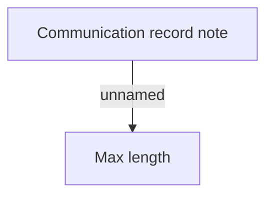

# Validation Rules

- **Diagram Type**: Custom
- **Package**: HomerSelect/BSL/Analysis Model/Client Management/Communication/Manage communication/Validation Rules
- **Diagram ID**: 91312
- **Elements**: 2
- **Connectors**: 1

