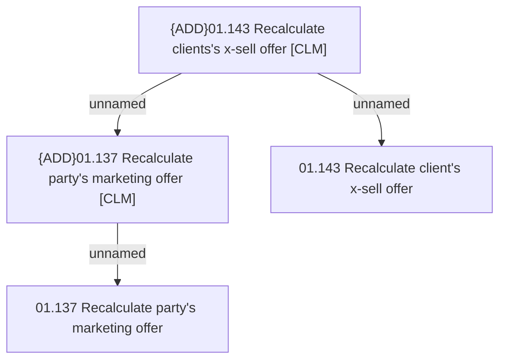

# Access rights

- **Diagram Type**: Custom
- **Package**: HomerSelect/BSL/Analysis Model/Client Management/Offer management/Access rights
- **Diagram ID**: 150605
- **Elements**: 4
- **Connectors**: 3

