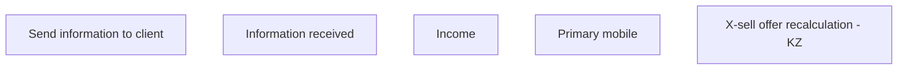

# Kazakhstan

- **Diagram Type**: Custom
- **Package**: HomerSelect/BSL/Analysis Model/Client Management/Offer management/User Interface Model/Kazakhstan
- **Diagram ID**: 159957
- **Elements**: 5
- **Connectors**: 0

