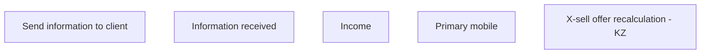

# Kazakhstan

```mermaid
graph TD
    Send_information_to_client["Send information to client"]
    Information_received["Information received"]
    Income["Income"]
    Primary_mobile["Primary mobile"]
    X_sell_offer_recalculation_KZ["X-sell offer recalculation - KZ"]
```
