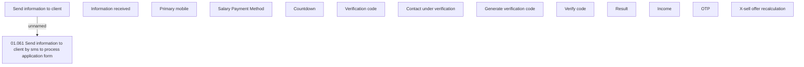

# Product

```mermaid
graph TD
    Send_information_to_client["Send information to client"]
    n_01_061_Send_information_to_client_by_sms_to_process_applic["01.061 Send information to client by sms to process application form"]
    Information_received["Information received"]
    Primary_mobile["Primary mobile"]
    Salary_Payment_Method["Salary Payment Method"]
    Countdown["Countdown"]
    Verification_code["Verification code"]
    Contact_under_verification["Contact under verification"]
    Generate_verification_code["Generate verification code"]
    Verify_code["Verify code"]
    Result["Result"]
    Income["Income"]
    OTP["OTP"]
    X_sell_offer_recalculation["X-sell offer recalculation"]
    Send_information_to_client -->|unnamed| n_01_061_Send_information_to_client_by_sms_to_process_applic
```
