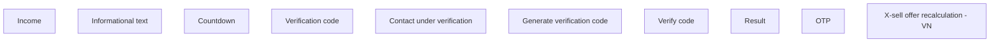

# Vietnam

- **Diagram Type**: Custom
- **Package**: HomerSelect/BSL/Analysis Model/Client Management/Offer management/User Interface Model/Vietnam
- **Diagram ID**: 159958
- **Elements**: 10
- **Connectors**: 0

