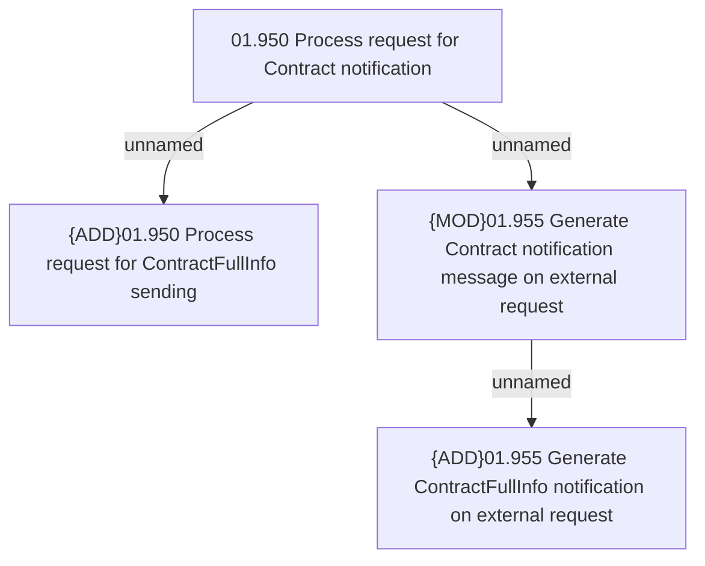

# Access Rights

```mermaid
graph TD
    ADD_01_955_Generate_ContractFullInfo_notification_on_externa["{ADD}01.955 Generate ContractFullInfo notification on external request"]
    ADD_01_950_Process_request_for_ContractFullInfo_sending["{ADD}01.950 Process request for ContractFullInfo sending"]
    n_01_950_Process_request_for_Contract_notification["01.950 Process request for Contract notification"]
    MOD_01_955_Generate_Contract_notification_message_on_externa["{MOD}01.955 Generate Contract notification message on external request"]
    n_01_950_Process_request_for_Contract_notification -->|unnamed| MOD_01_955_Generate_Contract_notification_message_on_externa
    n_01_950_Process_request_for_Contract_notification -->|unnamed| ADD_01_950_Process_request_for_ContractFullInfo_sending
    MOD_01_955_Generate_Contract_notification_message_on_externa -->|unnamed| ADD_01_955_Generate_ContractFullInfo_notification_on_externa
```
