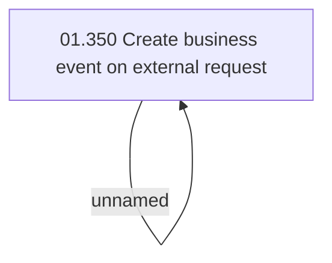

# Access rights

- **Diagram Type**: Custom
- **Package**: HomerSelect/BSL/Analysis Model/Contract Management/Business events/Access rights
- **Diagram ID**: 159736
- **Elements**: 2
- **Connectors**: 1

