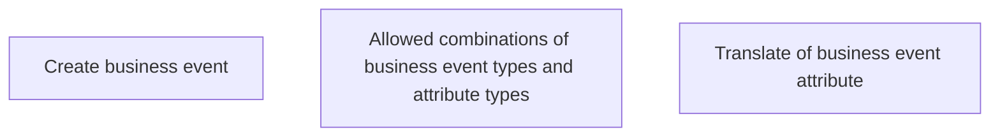

# Business events - Business rules

- **Diagram Type**: Custom
- **Package**: HomerSelect/BSL/Analysis Model/Contract Management/Business events/Business rules
- **Diagram ID**: 159741
- **Elements**: 3
- **Connectors**: 0

