# Common Business Rules for Contract Management

- **Diagram Type**: Custom
- **Package**: HomerSelect/BSL/Analysis Model/Contract Management/COMMON for Contract Management/Business Rules
- **Diagram ID**: 164418
- **Elements**: 22
- **Connectors**: 2

```mermaid
graph TD
    ADD_Check_if_contract_is_purchased["{ADD}Check if contract is purchased"]
    ADD_Set_condition_accepted_for_SAI_contract_on_related_Cash_["{ADD}Set condition accepted for SAI contract on related Cash Loan disbursement"]
    MOD_Get_actual_contract_owner["{MOD}Get actual contract owner"]
    Email_visibility_setting["Email visibility setting"]
    Getting_DMS_files_of_the_same_document_type_from_previous_co["Getting DMS files of the same document type from previous contracts"]
    Getting_Commodity_data_rule["Getting Commodity data rule"]
    MOD_Phone_number_visibility_setting["{MOD}Phone number visibility setting"]
    Check_scan_of_the_document_is_uploaded["Check scan of the document is uploaded"]
    Set_contract_Condition_Accepted["Set contract Condition Accepted"]
    MOD_Calculation_of_Loan_Service_parameters["{MOD}Calculation of Loan Service parameters"]
    Terminate_Contract_Service_if_cannot_be_processed["Terminate Contract Service if cannot be processed"]
    Contract_Status_Transition_Request_Check["Contract Status Transition Request Check"]
    Set_contract_status_to_approved["Set contract status to approved"]
    Get_Contract_Sign_Date["Get Contract Sign Date"]
    Terminate_Contract_Service_after_its_processing["Terminate Contract Service after its processing"]
    MOD_Generate_documents_list_for_contract_registration["{MOD}Generate documents list for contract registration"]
    Set_contract_status_to_canceled["Set contract status to canceled"]
    Set_contract_status_to_rejected["Set contract status to rejected"]
    Access_control_to_Commodity_by_Contract_status["Access control to Commodity by Contract status"]
    Access_control_to_Contract_by_Salesroom["Access control to Contract by Salesroom"]
    MOD_ALG_ECS_PROVIDER["{MOD}ALG_ECS_PROVIDER"]
    Order_of_documents_and_attributes_on_them["Order of documents and attributes on them"]
    ADD_Set_condition_accepted_for_SAI_contract_on_related_Cash_ -->|unnamed| Set_contract_Condition_Accepted
    MOD_Generate_documents_list_for_contract_registration -->|unnamed| Getting_DMS_files_of_the_same_document_type_from_previous_co
```

