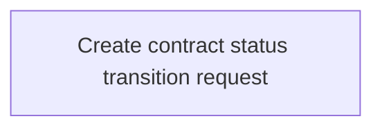

# Business Rules

- **Diagram Type**: Custom
- **Package**: HomerSelect/BSL/Analysis Model/Contract Management/COMMON for Contract Management/Contract status transition equest management/Business Rules
- **Diagram ID**: 145195
- **Elements**: 1
- **Connectors**: 0

