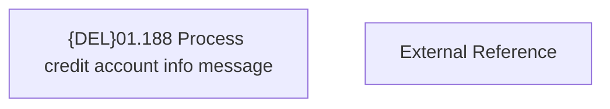

# Access Rights

- **Diagram Type**: Custom
- **Package**: HomerSelect/BSL/Analysis Model/Contract Management/COMMON for Contract Management/Messages processing/Access Rights
- **Diagram ID**: 157978
- **Elements**: 2
- **Connectors**: 0

